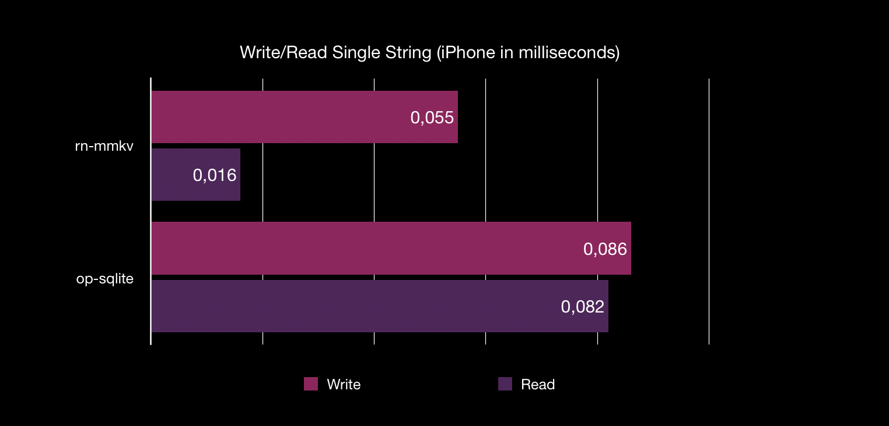

<div align="center">
  <pre align="center">
    yarn add @op-engineering/op-sqlite
    npx pod-install</pre>
  <br />
</div>
<br />

OP SQLite embeds the latest version of SQLite and provides a low-level API to execute SQL queries.

**Current SQLite version: 3.44.0**

Created by [@ospfranco](https://twitter.com/ospfranco). **Please consider Sponsoring**.

## Benchmarks

You can find the [benchmarking code in the example app](https://github.com/OP-Engineering/op-sqlite/blob/main/example/src/Database.ts#L44). This is run using the `OP_SQLITE_PERF` [performance flag](#perf-flag) which in turns disables some old and unused features of sqlite to squeeze the last drop of performance.


Memory consumption is also 1/4 compared to `react-native-quick-sqlite`. This query used to take 1.2 GB of peak memory usage, and now runs in 250mbs.

You can also turn on [Memory Mapping](#speed) to make your queries even faster by skipping the kernel during I/O and potentially reduce RAM usage, this comes with some disadvantages though. If you want even more speed and you can re-use your queries you can use [Prepared Statements](#prepared-statements).

Here is a benchmark with all the optimizations reading a single string value against react-native-mmkv. This might be a viable alternative if you want to reduce your bundle size and still keep perfomance when reading small data.



# Encryption

If you need to encrypt your entire database, there is [`op-sqlcipher`](https://github.com/OP-Engineering/op-sqlcipher), which is a fork of this library that uses [SQLCipher](https://github.com/sqlcipher/sqlcipher). It completely encrypts the database with minimal overhead.

# Database Location

## Default location

If you don't pass a `location` the library creates/opens databases by appending the passed name plus, the [library directory on iOS](https://github.com/OP-Engineering/op-sqlite/blob/main/ios/OPSQLite.mm#L51) and the [database directory on Android](https://github.com/OP-Engineering/op-sqlite/blob/main/android/src/main/java/com/op/sqlite/OPSQLiteBridge.java#L18).

## Relative location

You can use relative location to navigate in and out of the **default location**

```ts
import { open } from '@op-engineering/op-sqlite';

const db = open({
  name: 'myDB',
  location: '../files/databases',
});
```

Note that on iOS the file system is sand-boxed, so you cannot access files/directories outside your app bundle directories.

## Passing absolute paths

You can also pass absolute paths to completely change the location of the database, the library exports useful paths you can use:

```ts
import {
  IOS_LIBRARY_PATH, // Default iOS
  IOS_DOCUMENT_PATH,
  ANDROID_DATABASE_PATH, // Default Android
  ANDROID_FILES_PATH,
  ANDROID_EXTERNAL_FILES_PATH, // Android SD Card
  open,
} from '@op-engineering/op-sqlite';

const db = open({
  name: 'myDb',
  location: Platform.OS === 'ios' ? IOS_LIBRARY_PATH : ANDROID_DATABASE_PATH,
});
```

Here is an example if you want to access the SD card app's directory:

```ts
const db = open({
  name: 'myDB',
  location:
    Platform.OS === 'ios' ? IOS_LIBRARY_PATH : ANDROID_EXTERNAL_FILES_PATH,
});
```

You can even drill down:

```ts
const db = open({
  name: 'myDB',
  location:
    Platform.OS === 'ios'
      ? IOS_LIBRARY_PATH
      : `${ANDROID_EXTERNAL_FILES_PATH}/dbs/`,
});
```

## In-memory

Using SQLite in-memory mode is supported by passing a `':memory:'` as a location:

```ts
import { open } from '@op-engineering/op-sqlite';

const largeDb = open({
  name: 'inMemoryDb',
  location: ':memory:',
});
```

In memory databases are faster since they don't need to hit the disk I/O to save the data and are useful for synchronization only workflows.

# Performance

You can tweak SQLite to be faster (at the cost of some disadvantages). One possibility is [Memory Mapping](https://www.sqlite.org/mmap.html). It allows to read/write to/from the disk without going through the kernel. However, if your queries throw an error your application might crash.

To turn on Memory Mapping, execute the following pragma statement after opening a db:

```ts
const db = open({
  name: 'mydb.sqlite',
});

// 0 turns off memory mapping, any other number enables it with the cache size
db.execute('PRAGMA mmap_size=268435456');
```

You can also set journaling to memory (or even OFF if you are kinda crazy) to gain even more speed. Journaling is what allows SQLite to ROLLBACK statements and modifying it dangerous, so do it at your own risk

```ts
db.execute('PRAGMA journal_mode = MEMORY;'); // or OFF
```

If you use [prepared statements](#prepared-statements) are useful to reduce the time of critical queries.

# Perf flag

You can turn on the performance flag to tweak all possible performance enhancing compilation flags, this greatly affects performance of sqlite itself:

```sh
# For iOS install pods with the following env variable, you can also just an export like on Android
# OP_SQLITE_PERF=1 npx pod-install

# For Android you need to export the environment variable before running any command
export OP_SQLITE_PERF=1
# then any android build command will use the performance mode
yarn android
```

If correctly set you should see the following output in your console

```sh
OP-SQLITE performance mode enabled! 🚀
```

# SQLite Gotchas

## Strictness

It's important to notice SQLite unlike other databases by default does not strictly check for types, if you want true type safety when you declare your tables you need to use the `STRICT` keyword.

```ts
db.execute('CREATE TABLE Test (
              id INT PRIMARY KEY,
              name TEXT
          ) STRICT;');
```

If you don't set it, SQLite will happily write whatever you insert in your table, independtly of the declared type (it will try to cast it though, e.g. "1" string might be turned to 1 int).

## Foreign constraints

When SQLite evaluates your query and you have forgein key constraints, it keeps track of the satisfied relations via a counter. Once your statement finishes executing and the counter is not 0, it throws a foreign key constraint failed error. Unfortunately, this simple design means it is impossible to catch which foreign constraint is failed and you will receive a generic error. Nothing op-sqlite can do about it, it's a design flaw in SQLite.

In order to catch foreign key errors, you also need to execute the pragma when you open your connection:

```
PRAGMA foreign_keys = true
```

## Error codes

Sometimes you might be using valid SQL syntax for other engines or you might be doing something else wrong. The errors returned by op-sqlite contain the raw error code returned by SQLite and you should check [the reference](https://www.sqlite.org/rescode.html) for more detailed information.

## Quirks

See the [full list of SQLite quirks](https://www.sqlite.org/quirks.html).

# API

```typescript
import {open} from '@op-engineering/op-sqlite'

const db = open({name: 'myDb.sqlite'})

// The db object contains the following methods:
db = {
  close: () => void,
  delete: () => void,
  attach: (dbNameToAttach: string, alias: string, location?: string) => void,
  detach: (alias: string) => void,
  transaction: (fn: (tx: Transaction) => Promise<void>) => Promise<void>,
  execute: (query: string, params?: any[]) => QueryResult,
  executeAsync: (query: string, params?: any[]) => Promise<QueryResult>,
  executeBatch: (commands: SQLBatchTuple[]) => BatchQueryResult,
  executeBatchAsync: (commands: SQLBatchTuple[]) => Promise<BatchQueryResult>,
  loadFile: (location: string) => Promise<FileLoadResult>,
  updateHook: (
    callback: ((params: {
      table: string;
      operation: UpdateHookOperation;
      row?: any;
      rowId: number;
    }) => void) | null
  ) => void,
  commitHook: (callback: (() => void) | null) => void,
  rollbackHook: (callback: (() => void) | null) => void
}
```

## Simple queries

The basic query is **synchronous**, it will block rendering on large operations, further below you will find async versions.

```ts
import { open } from '@op-engineering/op-sqlite';

try {
  const db = open({ name: 'myDb.sqlite' });

  let { rows } = db.execute('SELECT somevalue FROM sometable');

  // _array internally holds the values, this is meant to comply with the webSQL spec
  rows._array.forEach((row) => {
    console.log(row);
  });

  let { rowsAffected } = await db.executeAsync(
    'UPDATE sometable SET somecolumn = ? where somekey = ?',
    [0, 1]
  );

  console.log(`Update affected ${rowsAffected} rows`);
} catch (e) {
  console.error('Something went wrong executing SQL commands:', e.message);
}
```

## Multiple statements in a single string

You can execute multiple statements in a single operation. The API however is not really thought for this use case and the results (and their metadata) will be mangled, so you can discard it.

```ts
// The result of this query will all be in a single array, no point in trying to read it
db.execute(
  `CREATE TABLE T1 ( id INT PRIMARY KEY) STRICT;
  CREATE TABLE T2 ( id INT PRIMARY KEY) STRICT;`
);

let t1name = db.execute(
  "SELECT name FROM sqlite_master WHERE type='table' AND name='T1';"
);

console.log(t1name.rows?._array[0].name); // outputs "T1"

let t2name = db.execute(
  "SELECT name FROM sqlite_master WHERE type='table' AND name='T2';"
);

console.log(t2name.rows?._array[0].name); // outputs "T2"
```

## Transactions

Throwing an error inside the callback will ROLLBACK the transaction.

If you want to execute a large set of commands as fast as possible you should use the `executeBatch` method, it wraps all the commands in a transaction and has less overhead.

```typescript
await db.transaction('myDatabase', (tx) => {
  const { status } = tx.execute(
    'UPDATE sometable SET somecolumn = ? where somekey = ?',
    [0, 1]
  );

  // offload from JS thread
  await tx.executeAsync = tx.executeAsync(
    'UPDATE sometable SET somecolumn = ? where somekey = ?',
    [0, 1]
  );

  // Any uncatched error ROLLBACK transaction
  throw new Error('Random Error!');

  // You can manually commit or rollback
  tx.commit();
  // or
  tx.rollback();
});
```

## Batch operation

Batch execution allows the transactional execution of a set of commands

```typescript
const commands = [
  ['CREATE TABLE TEST (id integer)'],
  ['INSERT INTO TEST (id) VALUES (?)', [1]],
  [('INSERT INTO TEST (id) VALUES (?)', [2])],
  [('INSERT INTO TEST (id) VALUES (?)', [[3], [4], [5], [6]])],
];

const res = db.executeSqlBatch('myDatabase', commands);

console.log(`Batch affected ${result.rowsAffected} rows`);
```

## Dynamic Column Metadata

In some scenarios, dynamic applications may need to get some metadata information about the returned result set.

This can be done by testing the returned data directly, but in some cases may not be enough, for example when data is stored outside
SQLite datatypes. When fetching data directly from tables or views linked to table columns, SQLite can identify the table declared types:

```typescript
let { metadata } = db.executeSql(
  'myDatabase',
  'SELECT int_column_1, bol_column_2 FROM sometable'
);

metadata.forEach((column) => {
  // Output:
  // int_column_1 - INTEGER
  // bol_column_2 - BOOLEAN
  console.log(`${column.name} - ${column.type}`);
});
```

## Async operations

You might have too much SQL to process and it will cause your application to freeze. There are async versions for some of the operations. This will offload the SQLite processing to a different thread.

```ts
db.executeAsync(
  'myDatabase',
  'SELECT * FROM "User";',
  []).then(({rows}) => {
    console.log('users', rows._array);
  })
);
```

## Blobs

Blobs are supported via `ArrayBuffer`, you need to be careful about the semantics though. You cannot instantiate an instance of `ArrayBuffer` directly, nor pass a typed array directly. Here is an example:

```ts
db = open({
  name: 'blobs',
});

db.execute('DROP TABLE IF EXISTS BlobTable;');
db.execute(
  'CREATE TABLE BlobTable ( id INT PRIMARY KEY, name TEXT NOT NULL, content BLOB) STRICT;'
);

let binaryData = new Uint8Array(2);
binaryData[0] = 42;

db.execute(`INSERT OR REPLACE INTO BlobTable VALUES (?, ?, ?);`, [
  1,
  'myTestBlob',
  binaryData,
]);

const result = db.execute('SELECT content FROM BlobTable');

const finalUint8 = new Uint8Array(result.rows!._array[0].content);
```

## Prepared statements

A lot of the work when executing queries is not iterating through the result set itself but, sometimes, planning the execution. If you have a query which is expensive but you can re-use (even if you have to change the arguments) you can use a `prepared statement`:

```ts
const statement = db.prepareStatement('SELECT * FROM User WHERE name = ?;');
statement.bind(['Oscar']);
let results1 = statement.execute();

statement.bind(['Carlos']);
let results2 = statement.execute();
```

You only pay the price of parsing the query once, and each subsequent execution should be faster.

# Attach or Detach other databases

SQLite supports attaching or detaching other database files into your main database connection through an alias.
You can do any operation you like on this attached database like JOIN results across tables in different schemas, or update data or objects.
These databases can have different configurations, like journal modes, and cache settings.

You can, at any moment, detach a database that you don't need anymore. You don't need to detach an attached database before closing your connection. Closing the main connection will detach any attached databases.

SQLite has a limit for attached databases: A default of 10, and a global max of 125

References: [Attach](https://www.sqlite.org/lang_attach.html) - [Detach](https://www.sqlite.org/lang_detach.html)

```ts
db.attach('mainDatabase', 'statistics', 'stats', '../databases');

const res = db.executeSql(
  'mainDatabase',
  'SELECT * FROM some_table_from_mainschema a INNER JOIN stats.some_table b on a.id_column = b.id_column'
);

// You can detach databases at any moment
db.detach('mainDatabase', 'stats');
if (!detachResult.status) {
  // Database de-attached
}
```

# Loading SQL Dump Files

If you have a SQL dump file, you can load it directly, with low memory consumption:

```typescript
const { rowsAffected, commands } = db
  .loadFile('myDatabase', '/absolute/path/to/file.sql')
  .then((res) => {
    const { rowsAffected, commands } = res;
  });
```

# Hooks

You can subscribe to changes in your database by using an update hook:

```ts
// Bear in mind: rowId is not your table primary key but the internal rowId sqlite uses
// to keep track of the table rows
db.updateHook(({ rowId, table, operation, row = {} }) => {
  console.warn(`Hook has been called, rowId: ${rowId}, ${table}, ${operation}`);
  // Will contain the entire row that changed
  // only on UPDATE and INSERT operations
  console.warn(JSON.stringify(row, null, 2));
});

db.execute('INSERT INTO "User" (id, name, age, networth) VALUES(?, ?, ?, ?)', [
  id,
  name,
  age,
  networth,
]);
```

Same goes for commit and rollback hooks

```ts
// will fire whenever a transaction commits
db.commitHook(() => {
  console.log('Transaction commmitted!');
});

db.rollbackHook(() => {
  console.log('Transaction rolled back!');
});

// will fire the commit hook
db.transaction(async (tx) => {
  tx.execute(
    'INSERT INTO "User" (id, name, age, networth) VALUES(?, ?, ?, ?)',
    [id, name, age, networth]
  );
});

// will fire the rollback hook
try {
  await db.transaction(async (tx) => {
    throw new Error('Test Error');
  });
} catch (e) {
  // intentionally left blank
}
```

You can pass `null`` to remove hooks at any moment:

```ts
db.updateHook(null);

db.commitHook(null);

db.rollbackHook(null);
```

# Use built-in SQLite

On iOS you can use the embedded SQLite, when running `pod-install` add an environment flag:

```
OP_SQLITE_USE_PHONE_VERSION=1 npx pod-install
```

On Android, it is not possible to link the OS SQLite. It is also a bad idea due to vendor changes, old android bugs, etc. Unfortunately, this means this library will add some megabytes to your app size.

# Enable compile-time options

By specifying pre-processor flags, you can enable optional features like FTS5, Geopoly, etc.

## iOS

Add a `post_install` block to your `<PROJECT_ROOT>/ios/Podfile` like so:

```ruby
post_install do |installer|
  installer.pods_project.targets.each do |target|
    if target.name == "op-sqlite" then
      target.build_configurations.each do |config|
        config.build_settings['GCC_PREPROCESSOR_DEFINITIONS'] << 'SQLITE_ENABLE_FTS5=1'
      end
    end
  end
end
```

Replace the `<SQLITE_FLAGS>` part with the flags you want to add.
For example, you could add `SQLITE_ENABLE_FTS5=1` to `GCC_PREPROCESSOR_DEFINITIONS` to enable FTS5 in the iOS project.

## Android

You can specify flags via `<PROJECT_ROOT>/android/gradle.properties` like so:

```
OPSQLiteFlags="-DSQLITE_ENABLE_FTS5=1"
```

# Additional configuration

## App groups (iOS only)

On iOS, the SQLite database can be placed in an app group, in order to make it accessible from other apps in that app group. E.g. for sharing capabilities.

To use an app group, add the app group ID as the value for the `OPSQLite_AppGroup` key in your project's `Info.plist` file. You'll also need to configure the app group in your project settings. (Xcode -> Project Settings -> Signing & Capabilities -> Add Capability -> App Groups)

# Contribute

You need to have clang-format installed (`brew install clang-format`)

# License

MIT License.
