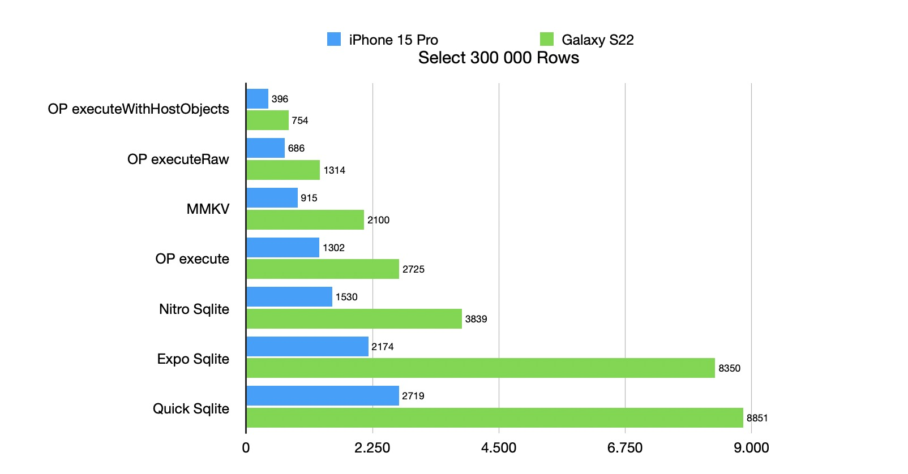

Created by [@ospfranco](https://twitter.com/ospfranco). **Please consider sponsoring!**.

OP-SQLite has grown large to cover a lot of plugins, sqlite versions and APIs. Please read the full documentation before opening an issue.

[Open the docs](https://op-engineering.github.io/op-sqlite/)

Join the Discord:

https://discord.gg/W9XmqCQCKP

Some of the big supported features:

- Vanilla sqlite
- Libsql is supported as a compilation target
- SQLCipher is supported as a compilation target
- FTS5 plugin
- Rtree plugin
- cr-sqlite plugin
- sqlite-vec plugin
- Reactive queries
- Custom tokenizers
- Load runtime extensions
- JSONB support

It also contains a simple [Key-Value store](https://op-engineering.github.io/op-sqlite/docs/key_value_storage) you can use without adding one more dependency to your app.

# License

MIT License.
