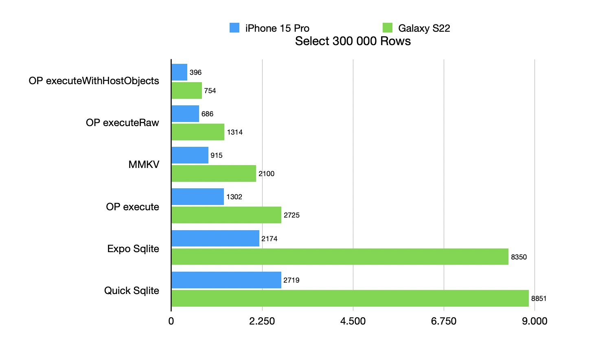

Created by [@ospfranco](https://twitter.com/ospfranco). **Please consider sponsoring!**.

OP-SQLite has grown large to cover a lot of plugins, sqlite versions and APIs. Please read the full documentation before opening an issue.

[See the docs](https://ospfranco.notion.site/OP-SQLite-Documentation-a279a52102464d0cb13c3fa230d2f2dc?pvs=4)

Join the Discord:

https://discord.gg/W9XmqCQCKP

Some of the big and external (back-ends, out-of-tree features, plugins) supported features:

- Vanilla sqlite ofc
- Libsql is supported as a sqlite backend
- SQLCipher is supported as a sqlite backend
- FTS5 plugin
- Rtree plugin
- cr-sqlite plugin
- sqlite-vec plugin
- Reactive queries (currently with some issues, please donate)

# License

MIT License.
